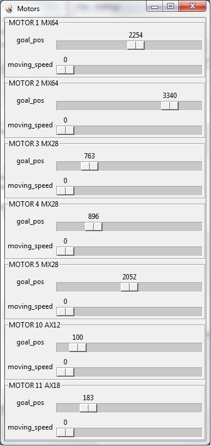

HumaRobotics Dynamixel Library
########################################################

HumaRobotics Dynamixel Library is a Python 2.7 library for programming Robotis Dynamixel motors directly from python or through the ROS bindings provided separately in https://github.com/HumaRobotics/dynamixel_hr_ros .
It also comes with a GUI that allows to quickly identify/configure/manipulate your motors.

.. toctree::
    :maxdepth: 1

Dynamixel models supported
==========================
At the moment it can handle the following models:
    * AX12*
    * AX18*
    * MX12*
    * MX28*
    * MX64*
    * RX64*
    * CM730

Adding other models is very easy, have a look in :mod:`dxl.dxlmotors` and simply add the corresponding model class that will contain the definitions of registers and conversion functions.

Dynamixel Lab
=============
Dynamixel Lab is a tk-based GUI for manipulating and programming Dynamixel motors that makes use of the Dynamixel Library.

It provides the following features:
    * Fast scanning of serial port on multiple baud rates using Ping broadcast (can be deactivated)
    * Automatic identification of all elements on the chain
    * Easy validation and reconfiguration of dynamixel chain using JSON formatted files
    * Access to all motors registers
    * Visualization and manipulation of motor IDs, baudrates, documentation
    * Pose recording and replay, saved as JSON files for easy modification
    * Motor window for quick manipulation of motor positions and speed
    * In-GUI Python coding for easy programming of chains of motors
    * Direct activation of ROS bindings, with optional conversion to SI units
    

.. figure:: images/MainWindow.png
   :scale: 100 %
   :align: center
   :alt: Main window of the Dynamixel Lab GUI

   *Main window of the Dynamixel Lab GUI*

   From the main window you can define the serial port parameters to be used, and scan for available motors. When connected to a chain, the configuration of all its elements is shown in JSON format which can be copied/pasted into files, modified, and written to the motors. The list on the left provides convenient access to important motor settings such as ID and baudrate, and also a direct link to the corresponding motor model documentation.
   
   

   *Motor window of the Dynamixel Lab GUI*

   The motors window allow to directly manipulate the motors positions and speed, allowing you to set the robot to specific poses that can then be recorded/reloaded from the main window.

.. figure:: images/PythonWindow.png
   :scale: 100 %
   :align: center
   :alt: Python window of the Dynamixel Lab GUI

   *Python window of the Dynamixel Lab GUI*

   The Python window can be used for direct programming of the motors using the provided API. The python context is already prepared so you don't need to import or instantiante anything, making the code minimal. 

Download
=======
You can obtain the latest sources using our Git repository:
git clone git@github.com/HumaRobotics:dynamixel_hr

You can also download the latest release as a compressed archive from:
http://www.humarobotics.com/downloads/dynamixel_hr.zip

Installation
============

Windows
-------
Setup drivers for USB2Dynamixel:
    * Install FTDI driver for USB2Dynamixel from http://www.ftdichip.com/Drivers/CDM/CDM20830_Setup.exe :
        * You may want to check documentation at http://www.ftdichip.com/Drivers/VCP.htm    
    * Follow instructions from http://support.robotis.com/en/software/dynamixel_sdk/usb2dynamixel/usb2dxl_windows.htm
    * Set USB: Port 21, max baudrate, delay 1

Setup python and pyserial:
    * Install Python 2.7 from http://www.python.org/ftp/python/2.7.6/python-2.7.6.msi
    * Install pyserial from https://pypi.python.org/packages/any/p/pyserial/pyserial-2.7.win32.exe

If required you can install the library by running the following command from the dynamixel_hr folder::

    python setup.py install

Ubuntu
------
Install python and pyserial::

    sudo apt-get install python2.7 python-serial

Access to the serial device (/tty/USB0 by default) needs special rights, so you'll need either to sudo or add your user to the dialout group::

    sudo usermod -a -G dialout username

If required you can install the library by running the following command from the dynamixel_hr folder::

    sudo python setup.py install
    

Dynamixel Lab Usage
=============
You can start the Dynamixel Lab by running::

    python ToolDynamixelLab.py

Library
=======

The provided Dynamixel Library is composed of several modules. However, from a user perspective only the dxl.dxlchain which provides Python access to the Dynamixel motors is directly used.
Here is a typical code example:

.. code:: python

    from dxl.dxlchain import DxlChain
 
    # Open the serial device
    chain=DxlChain("/dev/ttyUSB0",rate=3000000)

    # Load all the motors and obtain the list of IDs
    motors=chain.get_motor_list() # Discover all motors on the chain and return their IDs
    print motors

    # Move a bit
    chain.goto(1,500,speed=200) # Motor ID 1 is sent to position 500 with high speed
    chain.goto(1,100)                    # Motor ID 1 is sent to position 100 with last speed value

    # Move and print current position of all motors while moving
    chain.goto(1,1000,speed=20,blocking=False) # Motor ID 1 is sent to position 1000
    while chain.is_moving():
        print chain.get_position()

    # Disable the motors
    chain.disable()    

