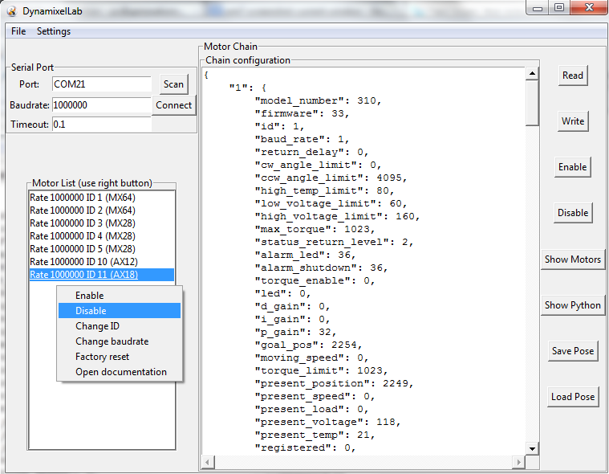
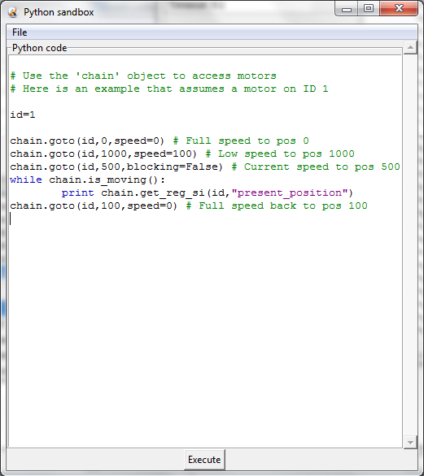

.. dynamixel_hr documentation master file, created by
   sphinx-quickstart on Tue Dec 10 09:08:51 2013.
   You can adapt this file completely to your liking, but it should at least
   contain the root `toctree` directive.

Welcome to HumaRobotics Dynamixel Library documentation!
########################################################

HumaRobotics Dynamixel Library is a Python 2.7 library for programming Robotis Dynamixel motors directly from python or through the ROS bindings provided.
It also comes with a GUI that allows to quickly identify/configure/manipulate your motors and expose them to a ROS master.

.. toctree::
    :maxdepth: 1

Dynamixel models supported
==========================
At the moment it can handle the following models:
    * AX12*
    * AX18*
    * MX28*
    * MX64*
    * CM730

Adding other models is very easy, have a look in :mod:`dxlmotors` and simply add the corresponding model class that will contain the definitions of registers and conversion functions.

Dynamixel Lab
=============
Dynamixel Lab is a tk-based GUI for manipulating and programming Dynamixel motors that makes use of the Dynamixel Library.

It provides the following features:
    * Fast scanning of serial port on multiple baud rates using Ping broadcast (can be deactivated)
    * Automatic identification of all elements on the chain
    * Easy validation and reconfiguration of dynamixel chain using JSON formatted files
    * Access to all motors registers
    * Visualization and manipulation of motor IDs, baudrates, documentation
    * Pose recording and replay, saved as JSON files for easy modification
    * Motor window for quick manipulation of motor positions and speed
    * In-GUI Python coding for easy programming of chains of motors
    * Direct activation of ROS bindings, with optional conversion to SI units
    

   *Main window of the Dynamixel Lab GUI*

   From the main window you can define the serial port parameters to be used, and scan for available motors. When connected to a chain, the configuration of all its elements is shown in JSON format which can be copied/pasted into files, modified, and written to the motors. The list on the left provides convenient access to important motor settings such as ID and baudrate, and also a direct link to the corresponding motor model documentation.
   
   
.. figure:: images/MotorsWindow.png
   :scale: 75 %
   :align: center
   :alt: Motor window of the Dynamixel Lab GUI

   *Motor window of the Dynamixel Lab GUI*

   The motors window allow to directly manipulate the motors positions and speed, allowing you to set the robot to specific poses that can then be recorded/reloaded from the main window.

   *Python window of the Dynamixel Lab GUI*

   The Python window can be used for direct programming of the motors using the provided API. The python context is already prepared so you don't need to import or instantiante anything, making the code minimal. 
   

Installation
============

Windows
-------
Setup drivers for USB2Dynamixel:
    * Install FTDI driver for USB2Dynamixel from http://www.ftdichip.com/Drivers/CDM/CDM20830_Setup.exe :
        * You may want to check documentation at http://www.ftdichip.com/Drivers/VCP.htm    
    * Follow instructions from http://support.robotis.com/en/software/dynamixel_sdk/usb2dynamixel/usb2dxl_windows.htm
    * Set USB: Port 21, max baudrate, delay 1

Setup python and pyserial:
    * Install Python 2.7 from http://www.python.org/ftp/python/2.7.6/python-2.7.6.msi
    * Install pyserial from https://pypi.python.org/packages/any/p/pyserial/pyserial-2.7.win32.exe
    
Ubuntu
------
Install python and pyserial::

    sudo apt-get install python2.7 python-serial

Access to the serial device (/tty/USB0 by default) needs special rights, so you'll need either to sudo or add your user to the dialout group::

    sudo usermod -a -G dialout username
    

ROS Bindings
============

Install ROS Groovy (on Ubuntu 12.04)::

    sudo sh -c 'echo "deb http://packages.ros.org/ros/ubuntu precise main" > /etc/apt/sources.list.d/ros-latest.list'
    wget http://packages.ros.org/ros.key -O - | sudo apt-key add -
    sudo apt-get update
    sudo apt-get install ros-groovy-desktop-full

Run a ROS master::

    source /opt/ros/groovy/setup.bash
    roscore
  
Run the ToolDynamixelLab with ROS bindings::

    source /opt/ros/groovy/setup.bash
    python ToolDynamixelLab.py --ros

Scan or connect to your motor chain, click on the ROS button to activate bindings (either Raw or international system units SI).

Indices and tables
==================

* :ref:`genindex`
* :ref:`modindex`
* :ref:`search`

.. automodule:: dxl.dxlchain
   :members:
.. automodule:: dxl.dxlcore
   :members:
.. automodule:: dxl.dxlmotors
   :members:
.. automodule:: dxl.dxlregisters
   :members:
.. automodule:: dxl.dxlros
   :members:

.. code:: python

 def my_function():
     "just a test"
     print 8/2